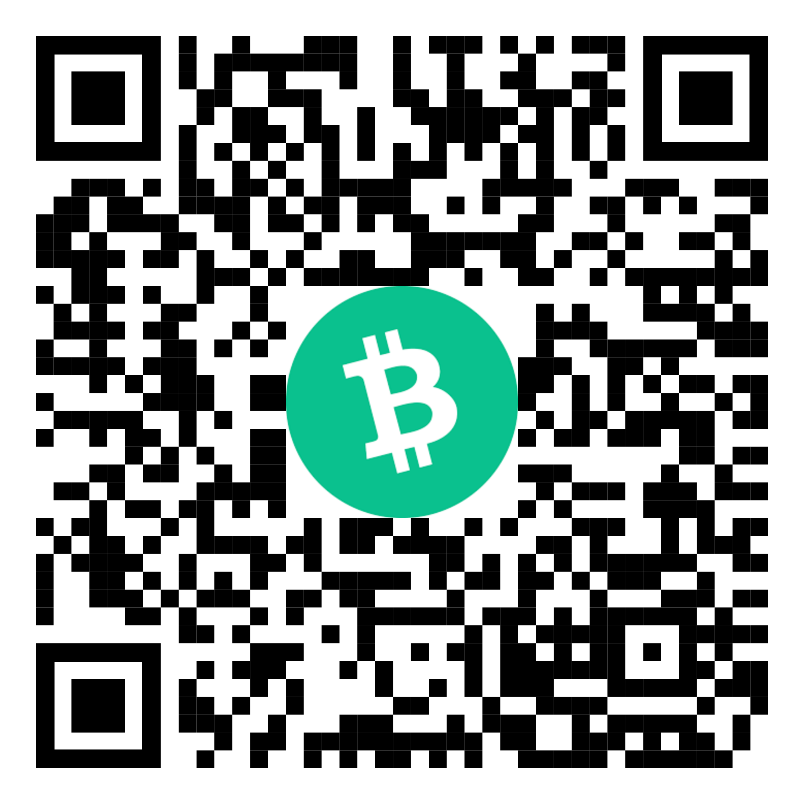

# PayCash

> To cater for the needs of those looking to accept Bitcoin Cash payments, PayCash provides buttons and widgets with QR code to facilitating the transaction process. This is enabled via a Bitcoin Cash gateway, a decentralised payment platform which allows merchants to accept Bitcoin Cash transactions at a lower cost, and faster than Bitcoin.


[](https://www.npmjs.com/package/@paycash/paycash)

## Install

### npm
```bash
npm install --save @paycash/paycash
```
### JavaScript
```
<script src="https://unpkg.com/@paycash/paycash/dist/paycash.js"></script>

```
## Usage
### HTML
> replacing YOUR_ADDRESS_HERE with an address from your Bitcoin Cash Address
#### Button
```
<script src="https://unpkg.com/@paycash/paycash/dist/paycash.js"></script>
<div class="paycash" to="YOUR_ADDRESS_HERE"></div>
```
#### Widget
```
<script src="https://unpkg.com/@paycash/paycash/dist/paycash.js"></script>
<div class="paycash-widget" to="bitcoincash:qznnqftcnq34vprgvhhnmr9yukd9deprl5dptmkh4f"></div>
```

#### Parameters
```
to="bitcoincash:qznnqftcnq34vprgvhhnmr9yukd9deprl5dptmkh4f"  <!-- BCH recive Address -->
amount=100                                                   <!-- Amount will convert to BCH -->                          
currency="USD"                                               <!-- fiat currency -->
text="Purchase"                                              <!-- text on Button -->
goal-amount="10"                                             <!-- gole amount -->
success-text="Thanks!"                                       <!-- success text -->
on-success="successCallback"                                 <!-- call back funcation -->
on-transaction="transactionCallback"                         <!-- call back funcation -->
random-satoshis="true"                                       <!--random satoshi for uniqueness  -->
hide-toasts= "false"                                         <!-- to hide deafult tosts -->
    
```
### React 
```
npm i --save @paycash/react
import { PayCash } from '@paycash/react'

function App() {
  function mySuccessFunction() {
    console.log("Success!")
  }

  const to = 'bitcoincash:qznnqftcnq34vprgvhhnmr9yukd9deprl5dptmkh4f'
  const amount = 5
  const currency = 'USD'
  const text = 'Help Has To Help Other'
  const onSuccess = mySuccessFunction()

  return <PayCash
    to={to}
    amount={amount}
    currency={currency}
    text={text}
    onSuccess={onSuccess}
  />
}
```
#### Button
```
import { PayCash as Button } from '@paycash/react'

function App() {
  return <Button
    to='bitcoincash:qznnqftcnq34vprgvhhnmr9yukd9deprl5dptmkh4f'
  />
}
export default App;
```
#### Widget
```
import { Widget as PayCashWidget } from '@paycash/react'

function App() {
  return <PayCashWidget
    to='bitcoincash:qznnqftcnq34vprgvhhnmr9yukd9deprl5dptmkh4f'
  />
}
export default App;
```

#### Parameters
```
to="bitcoincash:qznnqftcnq34vprgvhhnmr9yukd9deprl5dptmkh4f"  <!-- BCH recive Address -->
amount=100                                                   <!-- Amount will convert to BCH -->                          
currency="USD"                                               <!-- fiat currency -->
text="Purchase"                                              <!-- text on Button -->
goal-amount="10"                                             <!-- gole amount -->
success-text="Thanks!"                                       <!-- success text -->
on-success="successCallback"                                 <!-- call back funcation -->
on-transaction="transactionCallback"                         <!-- call back funcation -->
random-satoshis="true"                                       <!--random satoshi for uniqueness  -->
hide-toasts= "false"                                         <!-- to hide deafult tosts -->
    
```

### JavaScript
```
<script src="https://unpkg.com/@paycash/paycash/dist/paycash.js"></script>

<div id="button_id"></div>

<script>
function mySuccessFunction(txid, amount) {
  console.log( { txid, amount } );
}

function myTransactionFunction(txid, amount) {
  console.log( 'Received: ' + amount );
}

var config = {
  to: 'bitcoincash:qznnqftcnq34vprgvhhnmr9yukd9deprl5dptmkh4f',
  amount: 5,
  currency: 'USD',
  text: 'Tip Us a Coffee!',
  successText: 'Help Has To Help Other',
  onSuccess: mySuccessFunction,
  onTransaction: myTransactionFunction,
  randomSatoshis: true
};

PayCash.render(document.getElementById('button_id'), config);
</script>
```
#### Widget
```
<script src="https://unpkg.com/@paycash/paycash/dist/paycash.js"></script>
<div id="button_id"></div>

<script>
PayCash.renderWidget(document.getElementById('button_id'), { to: 'bitcoincash:qznnqftcnq34vprgvhhnmr9yukd9deprl5dptmkh4f' });
</script>
```

#### Parameters
```
to="bitcoincash:qznnqftcnq34vprgvhhnmr9yukd9deprl5dptmkh4f",  <!-- BCH recive Address -->
amount=100,                                                   <!-- Amount will convert to BCH -->                          
currency="USD",                                               <!-- fiat currency -->
text="Purchase",                                              <!-- text on Button -->
goal-amount="10",                                             <!-- gole amount -->
success-text="Thanks!",                                       <!-- success text -->
on-success="successCallback",                                 <!-- call back funcation -->
on-transaction="transactionCallback",                         <!-- call back funcation -->
random-satoshis="true",                                       <!--random satoshi for uniqueness  -->
hide-toasts= "false",                                         <!-- to hide deafult tosts -->
    
```
## License

MIT 

## Donation
### [Flipstarter Campaign](https://flipstarter.paycash.host/)

###### 


## Team 

team@paycash.host

